project 1
================
2023-02-13

### \*\*Cyclistic Bike Analysis (google project) Coded By R

#### **This is a Project provide by Google Data Analytics Professional Certificate**

**Google analytic program categorize the hole data analysis project into
6 phases:**

1.Ask

2.Prepare

3.Process

4.Analyze

5.Share

6.Act

</BR>

### **Ask**:

</BR>

**1.Identify the business task:**

To design marketing strategies aimed at converting casual riders into
annual members, since annual membership will be more profitable than
casual riders.

As a data analyst, my task is to identify Behavioral differences between
annual members and casual riders using Cyclistic bikes. This is the
first stage of compiling the business task, in the future, the data
analyst team will proceed to the next stage:

- Why would casual riders buy Cyclistic annual memberships?
- How can Cyclistic use digital media to influence casual riders to
  become members?

</BR>

**2.Consider key stakeholders:**

Main stakeholders:

- Lily Moreno: The director of marketing and my manager. By considering
  her role, it is best to perform a detailed analysis but as well
  clearly state the story behind the scene and provide suggestions.
  Since you can always connect with your manager and also she need your
  opinion for her decision.

Secondary stakeholders:

- Cyclistic executive team: The notoriously detail-oriented executive
  team.

</BR>

### **Prepare:**

Data preparation is the process of preparing raw data so that it is
suitable for further processing and analysis.

</BR>

**1.Credibility**

**Data located and organized**

Data is publicly released on amazon aws server, and organized with .csv
files. We will use the newest 12 months data for analysis.

**Reliable:**

The data is very large and all the ride records are counted, therefore
it is considerably reliable, however, some data missed certain
attributes and is necessary to be cleaned

**Original:**

This is the first party information generated by the data team, it is
indeed original.

**Comprehensive:**

Some of the data missing certain attributes value and needed further
process, it is not completely comprehensive.

**Current:**

On Amazon AWS server, the latest 12 months data is provided, hence it is
relevant.

**Cited:**

Data is clearly cited by Motivate International Inc, and
[license](https://ride.divvybikes.com/data-license-agreement) provided.

</BR>

**2. Sort and filter Data:**

To sort and filter data, we first need to integrate data, and perform
further investigation

``` r
# Load packages
library(tidyverse)
```

    ## ── Attaching core tidyverse packages ──────────────────────── tidyverse 2.0.0 ──
    ## ✔ dplyr     1.1.0     ✔ readr     2.1.4
    ## ✔ forcats   1.0.0     ✔ stringr   1.5.0
    ## ✔ ggplot2   3.4.1     ✔ tibble    3.1.8
    ## ✔ lubridate 1.9.2     ✔ tidyr     1.3.0
    ## ✔ purrr     1.0.1     
    ## ── Conflicts ────────────────────────────────────────── tidyverse_conflicts() ──
    ## ✖ dplyr::filter() masks stats::filter()
    ## ✖ dplyr::lag()    masks stats::lag()
    ## ℹ Use the ]8;;http://conflicted.r-lib.org/conflicted package]8;; to force all conflicts to become errors

``` r
library(dplyr)
library(geosphere)
library(ggplot2)
library(formattable)
library(gridExtra)
```

    ## 
    ## Attaching package: 'gridExtra'
    ## 
    ## The following object is masked from 'package:dplyr':
    ## 
    ##     combine

``` r
# Import Dataset
data_2022_01 <- read.csv("202201_tripdata.csv")
data_2022_02 <- read.csv("202202_tripdata.csv")
data_2022_03 <- read.csv("202203_tripdata.csv")
data_2022_04 <- read.csv("202204_tripdata.csv")
data_2022_05 <- read.csv("202205_tripdata.csv")
data_2022_06 <- read.csv("202206_tripdata.csv")
data_2022_07 <- read.csv("202207_tripdata.csv")
data_2022_08 <- read.csv("202208_tripdata.csv")
data_2022_09 <- read.csv("202209_tripdata.csv")
data_2022_10 <- read.csv("202210_tripdata.csv")
data_2022_11 <- read.csv("202211_tripdata.csv")
data_2022_12 <- read.csv("202212_tripdata.csv")
```

``` r
glimpse(data_2022_12)
```

    ## Rows: 181,806
    ## Columns: 13
    ## $ ride_id            <chr> "65DBD2F447EC51C2", "0C201AA7EA0EA1AD", "E0B148CCB3…
    ## $ rideable_type      <chr> "electric_bike", "classic_bike", "electric_bike", "…
    ## $ started_at         <chr> "2022-12-05 10:47:18", "2022-12-18 06:42:33", "2022…
    ## $ ended_at           <chr> "2022-12-05 10:56:34", "2022-12-18 07:08:44", "2022…
    ## $ start_station_name <chr> "Clifton Ave & Armitage Ave", "Broadway & Belmont A…
    ## $ start_station_id   <chr> "TA1307000163", "13277", "TA1306000015", "KA1503000…
    ## $ end_station_name   <chr> "Sedgwick St & Webster Ave", "Sedgwick St & Webster…
    ## $ end_station_id     <chr> "13191", "13191", "13016", "13134", "13288", "KA150…
    ## $ start_lat          <dbl> 41.91824, 41.94011, 41.88592, 41.83846, 41.89595, 4…
    ## $ start_lng          <dbl> -87.65711, -87.64545, -87.65113, -87.63541, -87.667…
    ## $ end_lat            <dbl> 41.92217, 41.92217, 41.89435, 41.88137, 41.92008, 4…
    ## $ end_lng            <dbl> -87.63889, -87.63889, -87.62280, -87.67493, -87.677…
    ## $ member_casual      <chr> "member", "casual", "member", "member", "casual", "…

There are 13 columns consists of **double** and **character** datatypes.
started_at attribute is a very important indicator to distinguish the
behavioral difference between annual member and causal riders, and could
be converted and extracted into other time stamps. Member_casual column
stated the rider type, and it is essential to the analysis.

</BR>

### **Process**

</BR>

**1.Tool used**

R is the only tool used in the project, since it is important to perform
the analysis within one platform for consistency.

</BR>

**2.Clean Data**

A function is created to insure the length/names/datatypes of columns in
all datasets are aligned with each other, then check columns between
datasets

``` r
checkcol <- function(x,y){
  format_x <- sapply(x,class)                         #make x column datatype into a vector
  format_y <- sapply(y,class)                         #make x column datatype into a vector
  for (i in 1:length(colnames(x))){
    if(length(colnames(x)) != length(colnames(y))){
      print("length of the two dataframe are not the same")
      break                                           #compare column length
    }
    else if(colnames(x)[i] != colnames(y)[i]){
      print("colnames are not the same")
      break                                           #compare column names
    }
    else if(format_x[i] != format_y[i]){
      print("col format are not the same")
      break                                           #compare datatypes 
    }
    else{
      print(paste0(i,"th col checked, Two columns are fully allined"))
    }
  }
}

checkcol(data_2022_01,data_2022_02)
```

    ## [1] "1th col checked, Two columns are fully allined"
    ## [1] "2th col checked, Two columns are fully allined"
    ## [1] "3th col checked, Two columns are fully allined"
    ## [1] "4th col checked, Two columns are fully allined"
    ## [1] "5th col checked, Two columns are fully allined"
    ## [1] "6th col checked, Two columns are fully allined"
    ## [1] "7th col checked, Two columns are fully allined"
    ## [1] "8th col checked, Two columns are fully allined"
    ## [1] "9th col checked, Two columns are fully allined"
    ## [1] "10th col checked, Two columns are fully allined"
    ## [1] "11th col checked, Two columns are fully allined"
    ## [1] "12th col checked, Two columns are fully allined"
    ## [1] "13th col checked, Two columns are fully allined"

``` r
checkcol(data_2022_01,data_2022_03)
```

    ## [1] "1th col checked, Two columns are fully allined"
    ## [1] "2th col checked, Two columns are fully allined"
    ## [1] "3th col checked, Two columns are fully allined"
    ## [1] "4th col checked, Two columns are fully allined"
    ## [1] "5th col checked, Two columns are fully allined"
    ## [1] "6th col checked, Two columns are fully allined"
    ## [1] "7th col checked, Two columns are fully allined"
    ## [1] "8th col checked, Two columns are fully allined"
    ## [1] "9th col checked, Two columns are fully allined"
    ## [1] "10th col checked, Two columns are fully allined"
    ## [1] "11th col checked, Two columns are fully allined"
    ## [1] "12th col checked, Two columns are fully allined"
    ## [1] "13th col checked, Two columns are fully allined"

``` r
checkcol(data_2022_01,data_2022_04)
```

    ## [1] "1th col checked, Two columns are fully allined"
    ## [1] "2th col checked, Two columns are fully allined"
    ## [1] "3th col checked, Two columns are fully allined"
    ## [1] "4th col checked, Two columns are fully allined"
    ## [1] "5th col checked, Two columns are fully allined"
    ## [1] "6th col checked, Two columns are fully allined"
    ## [1] "7th col checked, Two columns are fully allined"
    ## [1] "8th col checked, Two columns are fully allined"
    ## [1] "9th col checked, Two columns are fully allined"
    ## [1] "10th col checked, Two columns are fully allined"
    ## [1] "11th col checked, Two columns are fully allined"
    ## [1] "12th col checked, Two columns are fully allined"
    ## [1] "13th col checked, Two columns are fully allined"

``` r
checkcol(data_2022_01,data_2022_05)
```

    ## [1] "1th col checked, Two columns are fully allined"
    ## [1] "2th col checked, Two columns are fully allined"
    ## [1] "3th col checked, Two columns are fully allined"
    ## [1] "4th col checked, Two columns are fully allined"
    ## [1] "5th col checked, Two columns are fully allined"
    ## [1] "6th col checked, Two columns are fully allined"
    ## [1] "7th col checked, Two columns are fully allined"
    ## [1] "8th col checked, Two columns are fully allined"
    ## [1] "9th col checked, Two columns are fully allined"
    ## [1] "10th col checked, Two columns are fully allined"
    ## [1] "11th col checked, Two columns are fully allined"
    ## [1] "12th col checked, Two columns are fully allined"
    ## [1] "13th col checked, Two columns are fully allined"

``` r
checkcol(data_2022_01,data_2022_06)
```

    ## [1] "1th col checked, Two columns are fully allined"
    ## [1] "2th col checked, Two columns are fully allined"
    ## [1] "3th col checked, Two columns are fully allined"
    ## [1] "4th col checked, Two columns are fully allined"
    ## [1] "5th col checked, Two columns are fully allined"
    ## [1] "6th col checked, Two columns are fully allined"
    ## [1] "7th col checked, Two columns are fully allined"
    ## [1] "8th col checked, Two columns are fully allined"
    ## [1] "9th col checked, Two columns are fully allined"
    ## [1] "10th col checked, Two columns are fully allined"
    ## [1] "11th col checked, Two columns are fully allined"
    ## [1] "12th col checked, Two columns are fully allined"
    ## [1] "13th col checked, Two columns are fully allined"

``` r
checkcol(data_2022_01,data_2022_07)
```

    ## [1] "1th col checked, Two columns are fully allined"
    ## [1] "2th col checked, Two columns are fully allined"
    ## [1] "3th col checked, Two columns are fully allined"
    ## [1] "4th col checked, Two columns are fully allined"
    ## [1] "5th col checked, Two columns are fully allined"
    ## [1] "6th col checked, Two columns are fully allined"
    ## [1] "7th col checked, Two columns are fully allined"
    ## [1] "8th col checked, Two columns are fully allined"
    ## [1] "9th col checked, Two columns are fully allined"
    ## [1] "10th col checked, Two columns are fully allined"
    ## [1] "11th col checked, Two columns are fully allined"
    ## [1] "12th col checked, Two columns are fully allined"
    ## [1] "13th col checked, Two columns are fully allined"

``` r
checkcol(data_2022_01,data_2022_08)
```

    ## [1] "1th col checked, Two columns are fully allined"
    ## [1] "2th col checked, Two columns are fully allined"
    ## [1] "3th col checked, Two columns are fully allined"
    ## [1] "4th col checked, Two columns are fully allined"
    ## [1] "5th col checked, Two columns are fully allined"
    ## [1] "6th col checked, Two columns are fully allined"
    ## [1] "7th col checked, Two columns are fully allined"
    ## [1] "8th col checked, Two columns are fully allined"
    ## [1] "9th col checked, Two columns are fully allined"
    ## [1] "10th col checked, Two columns are fully allined"
    ## [1] "11th col checked, Two columns are fully allined"
    ## [1] "12th col checked, Two columns are fully allined"
    ## [1] "13th col checked, Two columns are fully allined"

``` r
checkcol(data_2022_01,data_2022_09)
```

    ## [1] "1th col checked, Two columns are fully allined"
    ## [1] "2th col checked, Two columns are fully allined"
    ## [1] "3th col checked, Two columns are fully allined"
    ## [1] "4th col checked, Two columns are fully allined"
    ## [1] "5th col checked, Two columns are fully allined"
    ## [1] "6th col checked, Two columns are fully allined"
    ## [1] "7th col checked, Two columns are fully allined"
    ## [1] "8th col checked, Two columns are fully allined"
    ## [1] "9th col checked, Two columns are fully allined"
    ## [1] "10th col checked, Two columns are fully allined"
    ## [1] "11th col checked, Two columns are fully allined"
    ## [1] "12th col checked, Two columns are fully allined"
    ## [1] "13th col checked, Two columns are fully allined"

``` r
checkcol(data_2022_01,data_2022_10)
```

    ## [1] "1th col checked, Two columns are fully allined"
    ## [1] "2th col checked, Two columns are fully allined"
    ## [1] "3th col checked, Two columns are fully allined"
    ## [1] "4th col checked, Two columns are fully allined"
    ## [1] "5th col checked, Two columns are fully allined"
    ## [1] "6th col checked, Two columns are fully allined"
    ## [1] "7th col checked, Two columns are fully allined"
    ## [1] "8th col checked, Two columns are fully allined"
    ## [1] "9th col checked, Two columns are fully allined"
    ## [1] "10th col checked, Two columns are fully allined"
    ## [1] "11th col checked, Two columns are fully allined"
    ## [1] "12th col checked, Two columns are fully allined"
    ## [1] "13th col checked, Two columns are fully allined"

``` r
checkcol(data_2022_01,data_2022_11)
```

    ## [1] "1th col checked, Two columns are fully allined"
    ## [1] "2th col checked, Two columns are fully allined"
    ## [1] "3th col checked, Two columns are fully allined"
    ## [1] "4th col checked, Two columns are fully allined"
    ## [1] "5th col checked, Two columns are fully allined"
    ## [1] "6th col checked, Two columns are fully allined"
    ## [1] "7th col checked, Two columns are fully allined"
    ## [1] "8th col checked, Two columns are fully allined"
    ## [1] "9th col checked, Two columns are fully allined"
    ## [1] "10th col checked, Two columns are fully allined"
    ## [1] "11th col checked, Two columns are fully allined"
    ## [1] "12th col checked, Two columns are fully allined"
    ## [1] "13th col checked, Two columns are fully allined"

``` r
checkcol(data_2022_01,data_2022_12)
```

    ## [1] "1th col checked, Two columns are fully allined"
    ## [1] "2th col checked, Two columns are fully allined"
    ## [1] "3th col checked, Two columns are fully allined"
    ## [1] "4th col checked, Two columns are fully allined"
    ## [1] "5th col checked, Two columns are fully allined"
    ## [1] "6th col checked, Two columns are fully allined"
    ## [1] "7th col checked, Two columns are fully allined"
    ## [1] "8th col checked, Two columns are fully allined"
    ## [1] "9th col checked, Two columns are fully allined"
    ## [1] "10th col checked, Two columns are fully allined"
    ## [1] "11th col checked, Two columns are fully allined"
    ## [1] "12th col checked, Two columns are fully allined"
    ## [1] "13th col checked, Two columns are fully allined"

After checking column are aligned among all the dataset, we are able to
combine them and remove the row data.

``` r
# bind all the data in previous 12 months in to union_data_frame
union_data_frame <- rbind(data_2022_01,data_2022_02,data_2022_03,data_2022_04,
                          data_2022_05,data_2022_06,data_2022_07,data_2022_08,
                          data_2022_09,data_2022_10,data_2022_11,data_2022_12)

# remove row data
rm(data_2022_01,data_2022_02,data_2022_03,data_2022_04,
   data_2022_05,data_2022_06,data_2022_07,data_2022_08,
   data_2022_09,data_2022_10,data_2022_11,data_2022_12)
```

A unified dataset was formed, the next step is to clean, reframe, and
create additional information through the data.

``` r
#Drop duplicate rows and rows with N/A value
union_data_frame <- union_data_frame %>%  
                    unique() %>% 
                    drop_na()

# crate a processed dataset called data_processed
data_processed <- union_data_frame %>% 
  # extract Year from started_at column
  mutate(started_at_year = as.numeric(format(as.Date(started_at), "%Y"))) %>%
  # extract Month from started_at column
  mutate(started_at_month = as.numeric(format(as.Date(started_at),"%m"))) %>%
  # extract Day from started_at column
  mutate(started_at_day = as.numeric(strftime(as.POSIXlt(started_at), "%d"))) %>% 
  # compute day of week from started_at column
  mutate(day_of_week = strftime(as.Date(started_at),"%a")) %>%
  # extract Hour of day from started_at column
  mutate(started_at_hour = as.numeric(strftime(as.POSIXlt(started_at), "%H"))) %>%
  # extract Hour of day from ended_at column
  mutate(ended_at_hour = as.numeric(strftime(as.POSIXlt(ended_at), "%H"))) %>%
  # compute ride time using ended_at and started_at columns
  mutate(ride_length_mins = as.numeric(difftime(ended_at,started_at,unit = "mins"))) %>%
  # get if it is rounded trip, but consider blank values in station_name and assigned as -1
  mutate(round_trip = ifelse(start_station_name == end_station_name & start_station_name != "" & 
                             end_station_name != "",
                             1,
                             ifelse(start_station_name == "" & end_station_name == "",
                                    -1,0 ))) %>%
  # get ride distance by using distHaversine function and calculate rowwise with c() fucntion
  rowwise %>%
  mutate(ride_distance = as.numeric(distHaversine(c(start_lng, start_lat), c(end_lng, 
                                                                             end_lat)))) %>%
  ungroup()

#set order to the day_of_week column, since it was originally present by string, ordered by
#alphabetical order
data_processed$day_of_week <- ordered(data_processed$day_of_week, levels = c("Sun","Mon","Tue","Wed","Thu","Fri","Sat"))

glimpse(data_processed)
```

    ## Rows: 5,661,859
    ## Columns: 22
    ## $ ride_id            <chr> "C2F7DD78E82EC875", "A6CF8980A652D272", "BD0F91DFF7…
    ## $ rideable_type      <chr> "electric_bike", "electric_bike", "classic_bike", "…
    ## $ started_at         <chr> "2022-01-13 11:59:47", "2022-01-10 08:41:56", "2022…
    ## $ ended_at           <chr> "2022-01-13 12:02:44", "2022-01-10 08:46:17", "2022…
    ## $ start_station_name <chr> "Glenwood Ave & Touhy Ave", "Glenwood Ave & Touhy A…
    ## $ start_station_id   <chr> "525", "525", "TA1306000016", "KA1504000151", "TA13…
    ## $ end_station_name   <chr> "Clark St & Touhy Ave", "Clark St & Touhy Ave", "Gr…
    ## $ end_station_id     <chr> "RP-007", "RP-007", "TA1307000001", "TA1309000021",…
    ## $ start_lat          <dbl> 42.01280, 42.01276, 41.92560, 41.98359, 41.87785, 4…
    ## $ start_lng          <dbl> -87.66591, -87.66597, -87.65371, -87.66915, -87.624…
    ## $ end_lat            <dbl> 42.01256, 42.01256, 41.92533, 41.96151, 41.88462, 4…
    ## $ end_lng            <dbl> -87.67437, -87.67437, -87.66580, -87.67139, -87.627…
    ## $ member_casual      <chr> "casual", "casual", "member", "casual", "member", "…
    ## $ started_at_year    <dbl> 2022, 2022, 2022, 2022, 2022, 2022, 2022, 2022, 202…
    ## $ started_at_month   <dbl> 1, 1, 1, 1, 1, 1, 1, 1, 1, 1, 1, 1, 1, 1, 1, 1, 1, …
    ## $ started_at_day     <dbl> 13, 10, 25, 4, 20, 11, 30, 22, 17, 28, 11, 29, 2, 2…
    ## $ day_of_week        <ord> Thu, Mon, Tue, Tue, Thu, Tue, Sun, Sat, Mon, Fri, T…
    ## $ started_at_hour    <dbl> 11, 8, 4, 0, 1, 18, 18, 12, 7, 15, 18, 12, 17, 22, …
    ## $ ended_at_hour      <dbl> 12, 8, 4, 0, 1, 18, 18, 12, 8, 15, 18, 12, 18, 22, …
    ## $ ride_length_mins   <dbl> 2.9500000, 4.3500000, 4.3500000, 14.9333333, 6.0333…
    ## $ round_trip         <dbl> 0, 0, 0, 0, 0, 0, 0, 0, 0, 0, 0, 0, 0, 0, 0, 1, 0, …
    ## $ ride_distance      <dbl> 700.3304, 695.0995, 1001.9534, 2465.5383, 815.4502,…

``` r
#get the maximum and minimum value of the data
summary_max <- data_processed %>% 
          summarize_all(max)
summary_min <- data_processed %>% 
          summarize_all(min)
```

after filtering data to show its maximum value for all columns, We see
there are extreme cases in the dataset for the ride time, therefore we
restrict the ride time length to be positive and less then 1 day (1440
mins)

Another issued occurred when filtering the data, extremely long ride
distances were cause by stating LNG and LAT as 0, thus remove LNG and
Lat with value of 0, and remove all trips longer then 100 Km:

``` r
data_processed <- data_processed %>% 
  filter(ride_length_mins > 0 & ride_length_mins < 1440) %>% 
  filter(end_lat != 0 & end_lng != 0) %>% 
  filter(start_lat !=0 & start_lng != 0) %>% 
  filter(ride_distance < 100000)

summary_max <- data_processed %>% 
  summarize_all(max)
summary_min <- data_processed %>% 
  summarize_all(min)
```

By the stage of process, we provide cleaned/organize/manipulable data
with ability to perform further analysis.

</BR>

### **Analyze**

**after Cleaning data and replenished useful information, analysis is
ready to launch.**

</BR>

**1.getting to know the big picture:**

It is essential to acknowledge the overall distribution of the riders.
By computing and illustrate

- Percentage of user type
- Distribution of Ride Vehicle
- Overall ride time and ride distance among member and casual riders

We will gain a big picture of the current situation and perform further
analysis.

``` r
#Calculate User percentage base on count of the rides
analysis_User_type_perc <-data_processed %>% 
  group_by(member_casual) %>% 
  summarize(n = n()) %>% 
  ungroup() %>% 
  mutate(total = sum(n)) %>% 
  group_by(member_casual) %>% 
  summarize(percentage = n/total)

ggplot(data= analysis_User_type_perc) +
  geom_col(aes(x=member_casual, y = percentage, fill = member_casual)) + 
 
  geom_text(aes(x=member_casual, y=percentage, label = scales:: percent(percentage,0.01)),
            position = position_stack(vjust = 0.5), size = 5, color = "black",
            fontface = "bold") +
  labs(title = "User Type of rides", x= "User Type", y= "Percentage of User Type")  +
  theme(legend.position = "right",
        plot.title = element_text(size = 20, color = "#42a0dd", face = "bold"),
        panel.background = element_rect(fill = NULL),
        axis.title.x = element_text(size=NULL, color = NULL))
```

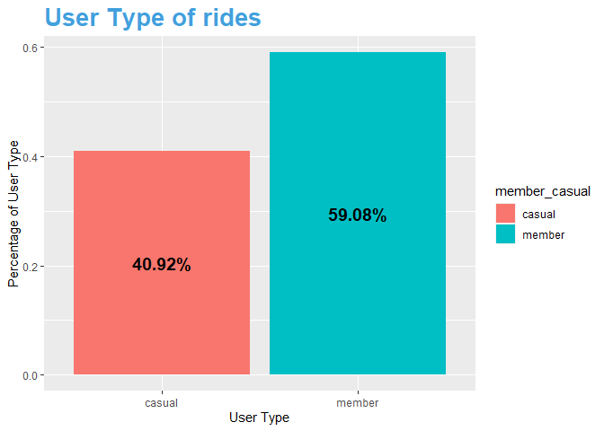<!-- -->

``` r
#compute average distance and time among User types
analysis_ride_dist_time <- data_processed %>% 
  group_by(member_casual) %>% 
  summarize(mean_dist = round(mean(ride_distance),2), 
            mean_time = round(mean(ride_length_mins),2),
            .groups = "drop_last")

graph_user_dis <- ggplot(data= analysis_ride_dist_time) +
  geom_col(aes(x = member_casual, y = mean_dist, fill = member_casual)) +
  labs(title = "Average ride distance by User type", x = "member or casual", y= "average distance (M)") +
  theme(legend.position = "NULL",
        plot.title = element_text(size = 13, color = "#42a0dd", face = "bold"),
        panel.background = element_rect(fill = NULL),
        axis.title.x = element_text(size=NULL, color = NULL)) +
  geom_text(aes(x = member_casual, y = mean_dist, label = mean_dist),
            position = position_stack(vjust = 0.5), size = 3,
            fontface = "bold")


graph_user_time <- ggplot(data= analysis_ride_dist_time) +
  geom_col(aes(x = member_casual, y = mean_time, fill = member_casual)) +
  labs(title = "Average Time used by user type", x = "member or casual", y= "average time (Mins)") +
  theme(legend.position = "NULL",
        plot.title = element_text(size = 13, color = "#42a0dd", face = "bold"),
        panel.background = element_rect(fill = NULL),
        axis.title.x = element_text(size=NULL, color = NULL)) +
  geom_text(aes(x = member_casual, y = mean_time, label = mean_time),
            position = position_stack(vjust = 0.5), size = 5,
            fontface = "bold")

graph_combine <- grid.arrange(graph_user_time, graph_user_dis, nrow = 1)
```

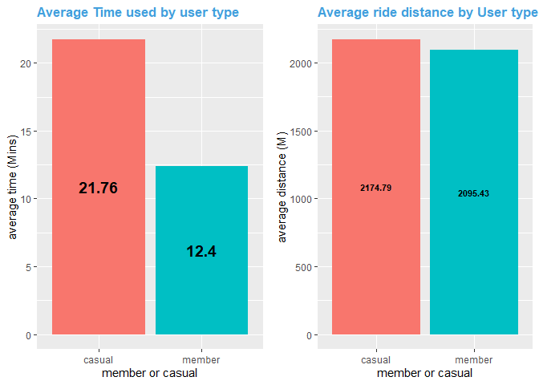<!-- -->

``` r
#calculate Ride type
analysis_ride_type_perc <- data_processed %>% 
  group_by(member_casual, rideable_type) %>% 
  summarize(count = n(), .groups = "drop_last") %>% 
  ungroup() %>% 
  group_by(member_casual) %>% 
  mutate(total = sum(count), perc = count/total)

ggplot(data = analysis_ride_type_perc) +
  geom_col(aes(x=rideable_type, y=perc, fill=rideable_type)) +
  facet_wrap(~member_casual) +
  geom_text(aes(x=rideable_type, y=perc, label = scales:: percent(perc,0.01)), 
            position = position_stack(vjust = 0.5), size = 5, fontface = "bold", color = "white") +
  labs(title = "Rideable type", x= "Types of bicycle", y="Percentage") +
  theme(legend.position = "right",
        plot.title = element_text(size = 20, color = "#42a0dd", face = "bold"),
        panel.background = element_rect(fill = NULL),
        axis.title.x = element_text(size=NULL, color = NULL))
```

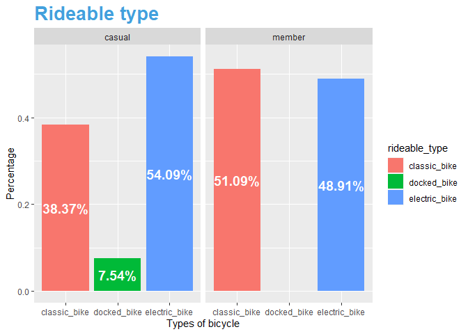<!-- -->

</BR>

**Analysis:**

- Overall user percentage:
  - The graph illustrated there are roughly 41 percent of casual riders,
    meaning the potential of conversion from casual to membership is
    high, reveals a good of potential of growth even the company don’t
    expend the overall customer size.
- Overall ride ride time and distance:
  - The average riding time of Causal riders is around 22 minutes,
    almost 2 times then the member riders, 12 minutes. However, the
    distance didn’t infer the difference, the different of ride distance
    is within 5 percent. May cause by speed or riding style.
- Overall rideable type:
  - Casual riders have the highest percentage usage of electric bikes,
    meanwhile the usage of different bike by membership are nearly
    identical. It is interesting that member riders don’t have any usage
    of docked bike.

</BR>

**From analyzing the graphs, we can infer a large convertible casual
riders may have different purposes using the bicycle, for the further
analysis, we need to bring these questions:**

- What are the trends and flow of user behavior which may varies from
  casual and members, or anything in common?

- what are the mutual and exclusive purpose of using the bicycle among
  casual and members.

- Are we able to address conclusions by the evidence from the analysis?

</BR>

**2.identify trends and flow of the users**

By analyzing the trend and flow to seek mutual and exclusive behavior
among users, we will create graphs of:

- ride numbers and ride time separated by months.

- ride numbers and ride time separated by day of week.

- ride numbers and ride time separated by hours in a day.

``` r
analysis_start_month <- data_processed %>% 
  group_by(started_at_month, member_casual) %>% 
  summarize(mean_ride_len = mean(ride_length_mins), num_of_ride = n(),
            mean_distance = mean(ride_distance),
            .groups = "drop_last") %>% 
  ungroup()

ggplot(data=analysis_start_month) +
  geom_col(aes(x=started_at_month, y=num_of_ride, fill=member_casual),
           position = "dodge") +
  labs(title = "Number of ride in each month", x = "start at month", y= "number of ride") +
  theme(legend.position = "right",
        plot.title = element_text(size = 20, color = "#42a0dd", face = "bold"),
        panel.background = element_rect(fill = NULL),
        axis.title.x = element_text(size=NULL, color = NULL)) +
  scale_x_continuous(breaks = seq(1,12,1)) +
  scale_fill_manual(values = c("casual" = "#2B8CD7", "member" = "#F3B013"))
```

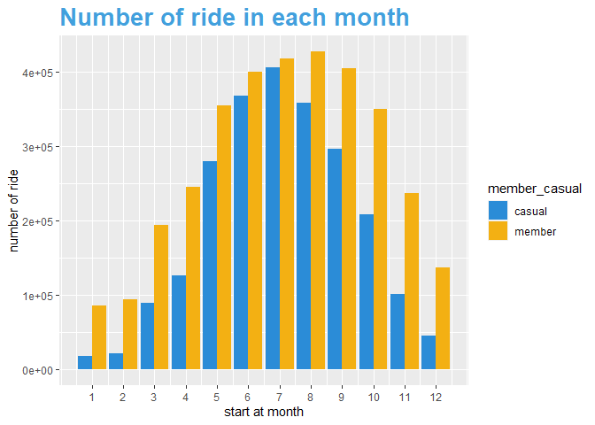<!-- -->

``` r
ggplot(data=analysis_start_month) +
  geom_col(aes(x=started_at_month, y=mean_ride_len, fill=member_casual),
           position = "dodge") +
  labs(title = "Time of ride in each month", x = "start at month", y= "average ride time") +
  theme(legend.position = "right",
        plot.title = element_text(size = 20, color = "#42a0dd", face = "bold"),
        panel.background = element_rect(fill = NULL),
        axis.title.x = element_text(size=NULL, color = NULL)) +
  scale_x_continuous(breaks = seq(1,12,1)) +
  scale_fill_manual(values = c("casual" = "#2B8CD7", "member" = "#F3B013"))
```

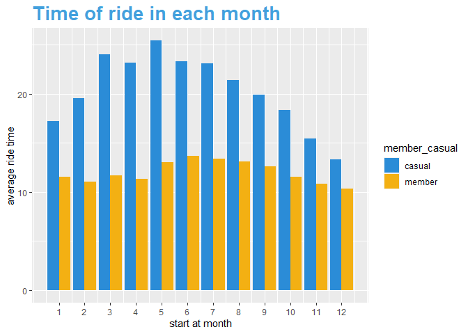<!-- -->

``` r
analysis_start_Wday <- data_processed %>% 
  group_by(day_of_week, member_casual) %>% 
  summarize(mean_ride_len = mean(ride_length_mins), num_of_ride = n(),
            mean_distance = mean(ride_distance),
            .groups = "drop_last") %>%
  ungroup()

ggplot(data = analysis_start_Wday) + 
  geom_col(mapping = aes(x=day_of_week, y= num_of_ride, fill = member_casual)
           ,position = "dodge2") +
  labs(title = "Number of ride in day of week", x= "day of week", y = "number of ride",
        caption = "onthefk") +
  theme(legend.position = "right",
        panel.background = element_rect(fill = NULL),
        plot.title = element_text(size = 20, color = "#42a0dd", face = "bold"),
        axis.title.x = element_text(size=NULL, color = NULL)) +
  scale_fill_manual(values = c("casual" = "#2B8CD7", "member" = "#F3B013"))
```

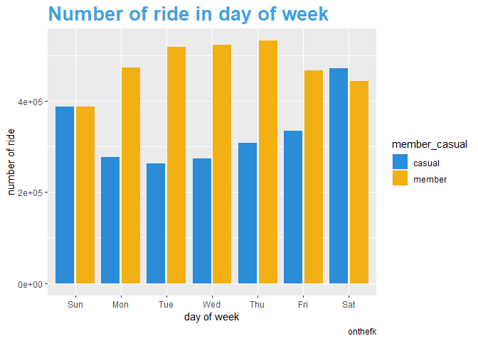<!-- -->

``` r
ggplot(data = analysis_start_Wday) + 
  geom_col(mapping = aes(x=day_of_week, y= mean_ride_len, fill = member_casual)
           ,position = "dodge2") +
  labs(title = "Time of ride in day of week", x= "day of week", y = "average ride time",
        caption = "onthefk") +
  theme(legend.position = "right",
        panel.background = element_rect(fill = NULL),
        plot.title = element_text(size = 20, color = "#42a0dd", face = "bold"),
        axis.title.x = element_text(size=NULL, color = NULL)) +
  scale_fill_manual(values = c("casual" = "#2B8CD7", "member" = "#F3B013"))
```

<!-- -->

``` r
analysis_start_hour <- data_processed %>% 
  group_by(started_at_hour, member_casual) %>% 
  summarize(mean_ride_len = mean(ride_length_mins), num_of_ride = n(),
            mean_distance = mean(ride_distance),
            .groups = "drop_last") %>% 
  ungroup()


ggplot(data=analysis_start_hour) +
  geom_col(aes(x=started_at_hour, y=num_of_ride, fill=member_casual),
           position = "dodge") +
  labs(title = "Number of ride at start hour", x = "start at hour", y= "number of ride") +
  theme(legend.position = "right",
        plot.title = element_text(size = 20, color = "#42a0dd", face = "bold"),
        panel.background = element_rect(fill = NULL),
        axis.title.x = element_text(size=NULL, color = NULL)) +
  scale_x_continuous(breaks = seq(0,23,1)) +
  scale_fill_manual(values = c("casual" = "#2B8CD7", "member" = "#F3B013"))
```

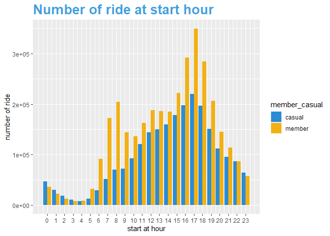<!-- -->

``` r
ggplot(data=analysis_start_hour) +
  geom_col(aes(x=started_at_hour, y=mean_ride_len, fill=member_casual),
           position = "dodge") +
  labs(title = "Time of ride at start hour", x = "start at time", y= "average ride time") +
  theme(legend.position = "right",
        plot.title = element_text(size = 20, color = "#42a0dd", face = "bold"),
        panel.background = element_rect(fill = NULL),
        axis.title.x = element_text(size=NULL, color = NULL))+
  scale_x_continuous(breaks = seq(0,23,1))+
  scale_fill_manual(values = c("casual" = "#2B8CD7", "member" = "#F3B013"))
```

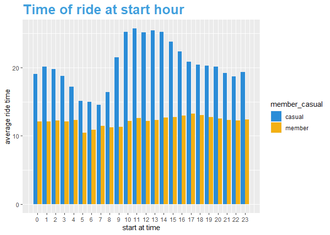<!-- -->

</BR>

**Analysis**

- Month analysis:

  - For number of rides each months, both member and casual riders
    formed a normal distribution shape which topped at summer time,
    therefore the number of rides is sensitive to the weather. However,
    casual users are more sensitive to temp since the number dropped
    drastically in October, meaning that the necessity of bike is higher
    in member riders.

  - Compared to Casual users, member rider’s ride time is more stable,
    inferring they may have fixed ride routes.

- Day of week analysis:

  - For member riders, their number of rides peaked in the weekdays, and
    less in the weekends, in contrast, more casual riders during
    weekends. The ride time of member shows stability that differentiate
    the causal riders.

- Hour analysis:

  - Member riders out-numbered the casual rider in 6-9 and 16-19 o
    clock, which are the time range of Commute time range.

  - A interest point shows that the ride time bottomed from 6-9 for
    casual user, meaning a very high percentage of casual riders used
    bicycle as commute vehicle during 6-9, and higher percentage for
    exercise and entertainment purposes at noon.

**By analyzing the graphs, we can infer the membership users are more
leaning towards commute-use, causal users may have other major purpose
such as exercise and entertainment, but as well have a decent percentage
of commute-use**

- Next, we will perform segmentation of purpose and gain some more
  insights.

</BR>

**3.segmentation analysis**

``` r
analysis_round_trip_perc <- data_processed %>% 
  filter(round_trip != -1) %>% 
  group_by(member_casual,round_trip) %>% 
  summarize(count = n(), .groups = "drop_last") %>% 
  ungroup() %>% 
  group_by(member_casual) %>% 
  mutate(group_total = sum(count)) %>% 
  ungroup() %>% 
  group_by(member_casual,round_trip) %>% 
  summarise(perc = max(count)/max(group_total), .groups = "drop_last") %>% 
  ungroup() %>% 
  mutate(round_trip = ifelse(round_trip == 1, "round", "not round"))

 ggplot(data=analysis_round_trip_perc) +
  geom_col(aes(x="", y=perc, fill= round_trip)) +
  coord_polar("y", start = 0, direction = 1) +
  facet_wrap(~member_casual )+
  geom_text(aes(x="", y=perc, label = scales:: percent(perc,0.01)),
            position = position_stack(vjust = 0.5), size = 5, color = "white",
            fontface = "bold") +
  labs(title = "Rounded trip percentage", x= NULL, y= "Percentage of round trip") +
  theme(axis.text = element_blank(),
        axis.line = element_blank(),
        panel.grid.major = element_blank(),
        plot.title = element_text(size = 20, color = "#42a0dd", face = "bold"),
        panel.background = element_rect(fill = "white"))
```

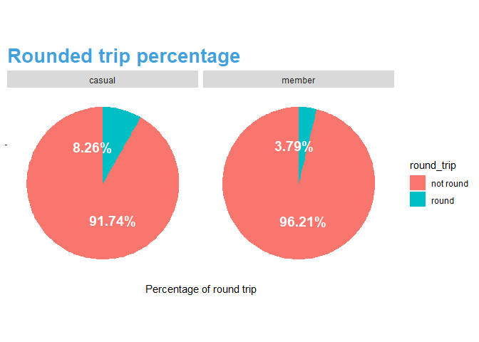<!-- -->

``` r
analysis_mor <- data_processed %>% 
  filter(ride_length_mins <= 2* sd(ride_length_mins) & started_at_hour %in% c(7:10)) %>% 
  group_by(member_casual) %>% 
  mutate(average_time = median(ride_length_mins))

analysis_aft<- data_processed %>% 
  filter(ride_length_mins <= 2* sd(ride_length_mins) & started_at_hour %in% c(16:19)) %>% 
  group_by(member_casual) %>% 
  mutate(average_time = median(ride_length_mins))

analysis_noon<- data_processed %>% 
  filter(ride_length_mins <= 2* sd(ride_length_mins) & started_at_hour %in% c(11:15)) %>% 
  group_by(member_casual) %>% 
  mutate(average_time = median(ride_length_mins))
 
graph_afternoon <- ggplot(data=analysis_aft)+
  geom_line(aes(x=ride_length_mins, color = member_casual) , 
            stat = "bin", binwidth = 0.1) +
  geom_vline(aes(xintercept = average_time, color = member_casual), linetype = "dashed") +
  labs(title = "Number of ride Vs. ride time between 4pm to 7pm", x= "Ride time"
       ,y= "Number of rides") +
  theme(legend.position = "right",
        plot.title = element_text(size = 10, color = "#42a0dd", face = "bold"),
        panel.background = element_rect(fill = NULL),
        axis.title.x = element_blank())+
  scale_x_continuous(breaks = seq(0,60,5))

graph_morning <- ggplot(data=analysis_mor)+
  geom_line(aes(x=ride_length_mins, color = member_casual) , 
            stat = "bin", binwidth = 0.1) +
  geom_vline(aes(xintercept = average_time, color = member_casual), linetype = "dashed") +
  labs(title = "Number of ride Vs. ride time between 7am to 10am", x= "Ride time"
       , y= "Number of rides") +
  theme(legend.position = "right",
        plot.title = element_text(size = 10, color = "#42a0dd", face = "bold"),
        panel.background = element_rect(fill = NULL),
        axis.title.x = element_blank()) +
  scale_x_continuous(breaks = seq(0,60,5))

graph_noon <- ggplot(data=analysis_noon)+
  geom_line(aes(x=ride_length_mins, color = member_casual) , 
            stat = "bin", binwidth = 0.1) +
  geom_vline(aes(xintercept = average_time, color = member_casual), linetype = "dashed") +
  labs(title = "Number of ride Vs. ride time between 11am to 3pm", x= "Ride time"
       , y= "Number of rides") +
  theme(legend.position = "right",
        plot.title = element_text(size = 10, color = "#42a0dd", face = "bold"),
        panel.background = element_rect(fill = NULL),
        axis.title.x = element_blank()) +
  scale_x_continuous(breaks = seq(0,60,5))

grid.arrange(graph_morning, graph_noon, graph_afternoon, ncol = 1)
```

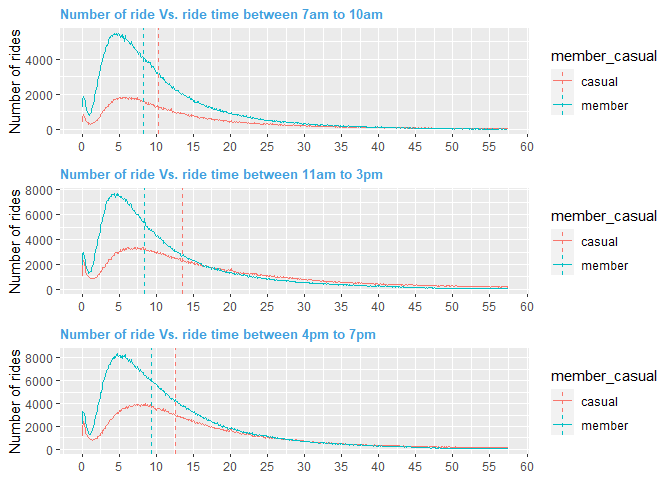<!-- -->

``` r
analysis_wday_line <- data_processed %>% 
  filter(ride_length_mins <= 2* sd(ride_length_mins) & day_of_week %in% c("Mon","Tue","Wed","Thu","Fri")) %>% 
  group_by(member_casual) %>% 
  mutate(average_time = median(ride_length_mins))

analysis_wend_line <- data_processed %>% 
  filter(ride_length_mins <= 2* sd(ride_length_mins) & day_of_week %in% c("Sat","Sun")) %>% 
  group_by(member_casual) %>% 
  mutate(average_time = median(ride_length_mins))


graph_wday_line <- ggplot(data=analysis_wday_line)+
  geom_line(aes(x=ride_length_mins, color = member_casual) , 
            stat = "bin", binwidth = 0.1) +
  geom_vline(aes(xintercept = average_time, color = member_casual), linetype = "dashed") +
  labs(title = "Number of ride Vs. ride time in weekday", x= "Ride time"
       ,y= "Number of rides") +
  theme(legend.position = c(0.85,0.7),
        plot.title = element_text(size = 10, color = "#42a0dd", face = "bold"),
        panel.background = element_rect(fill = NULL),
        axis.title.x = element_blank())+
  scale_x_continuous(breaks = seq(0,60,5))

graph_wend_line <- ggplot(data=analysis_wend_line)+
  geom_line(aes(x=ride_length_mins, color = member_casual) , 
            stat = "bin", binwidth = 0.1) +
  geom_vline(aes(xintercept = average_time, color = member_casual), linetype = "dashed") +
  labs(title = "Number of ride Vs. ride time in weekend", x= "Ride time"
       , y= "Number of rides") +
  theme(legend.position = c(0.85,0.7),
        plot.title = element_text(size = 10, color = "#42a0dd", face = "bold"),
        panel.background = element_rect(fill = NULL),
        axis.title.x = element_blank()) +
  scale_x_continuous(breaks = seq(0,60,5))

holy <- grid.arrange(graph_wday_line, graph_wend_line, ncol = 1)
```

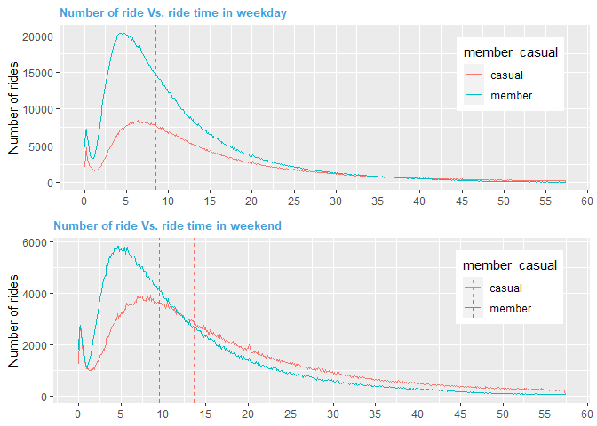<!-- -->

``` r
analysis_User_type_perc_wday <-data_processed %>% 
  filter(day_of_week %in% c("Mon","Tue","Wed","Thu","Fri")) %>% 
  group_by(member_casual, rideable_type) %>% 
  summarize(count = n(), .groups = "drop_last") %>% 
  ungroup() %>% 
  group_by(member_casual) %>% 
  mutate(total = sum(count), perc = count/total)

analysis_User_type_perc_wend <-data_processed %>% 
  filter(day_of_week %in% c("Sat","Sun")) %>% 
  group_by(member_casual, rideable_type) %>% 
  summarize(count = n(), .groups = "drop_last") %>% 
  ungroup() %>% 
  group_by(member_casual) %>% 
  mutate(total = sum(count), perc = count/total)

graph_usertype_perc_wday <-
  ggplot(data = analysis_User_type_perc_wday) +
  geom_col(aes(x=rideable_type, y=perc, fill=rideable_type)) +
  facet_wrap(~member_casual) +
  geom_text(aes(x=rideable_type, y=perc, label = scales:: percent(perc,0.01)), 
            position = position_stack(vjust = 0.5), size = 3.5, fontface = "bold", color = "black") +
  labs(title = "Rideable type in Weekday", x= "Types of bicycle", y="Percentage") +
  theme(legend.position = "none",
        plot.title = element_text(size = 12, color = "#42a0dd", face = "bold"),
        panel.background = element_rect(fill = NULL),
        axis.title = element_blank())

graph_usertype_perc_wend <-
  ggplot(data = analysis_User_type_perc_wend) +
  geom_col(aes(x=rideable_type, y=perc, fill=rideable_type)) +
  facet_wrap(~member_casual) +
  geom_text(aes(x=rideable_type, y=perc, label = scales:: percent(perc,0.01)), 
            position = position_stack(vjust = 0.5), size = 3.5, fontface = "bold", color = "black") +
  labs(title = "Rideable type in Weekend", x= "Types of bicycle", y="Percentage") +
  theme(legend.position = "none",
        plot.title = element_text(size = 12, color = "#42a0dd", face = "bold"),
        panel.background = element_rect(fill = NULL),
        axis.title = element_blank())

grid.arrange(graph_usertype_perc_wday, graph_usertype_perc_wend, ncol = 1)
```

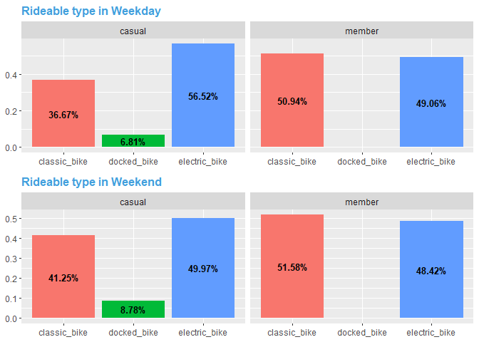<!-- -->

</BR>

**Analysis**

- Round trip analysis:

  - Casual riders have doubled the percentage of rounded trip than
    member riders, shows higher percentage of causal uses, however, it
    is less then 10 percent.

- Number of rides vs. ride time in hour ranges:

  - Among 3 graphs, casual rider’s ride time always exceed the members’,
    even in the morning, possibly the commute range is longer for casual
    riders. Gap of median between member and casual riders is biggest at
    noon, indicate more casual use for casual users out of commute time.

- Number of rides vs. ride time by day of week:

  - Also support the argument that casual use will take longer time then
    commute use.

- Rideable type by day of week:

  - It is very interesting that for causal user, the use of electric
    bike decreased nearly 6 percent at weekends. Assuming higher commute
    use in weekdays, the dramatic decrease of electric bike usage at
    weekend may indicate a longer distance of commute route, or it is
    too lazy for them to ride a classic bike for commute.

**By analyzing the graph, it support the statement previously stated,
and gained some insights for the behavior of causal rider for commute
purpose.**

</BR>

### **Share**

</BR>

**By analyzing the data, some essential information is revealed**

- High potential of profit gain from a large number of convertible
  causal rider

- Number of rides peaks in summer and low in winter, temperature
  sensitive.

- Causal riders have higher percentage of Causal use, such as
  entertainment, tourism, and exercise. Member riders are more practical
  for commute uses.

- Casual riders uses bikes less often for the morning commute, and are
  active at noon and afternoon. Member riders rides more in the morning,
  but follow the same pattern in the rest of day.

- Casual riders uses electric bikes more, even in commute time.

</BR>

### **Act**

</BR>

- Intensify promotion for membership in summertime , since more total
  customer usage.

- Improve user Viscosity for commute users by setting coffee chat groups
  on phone apps, persuade them to ride for morning commute together.
  Implant ride life-style for work

- Improve user Viscosity for entertainment/exercise/tourism users by set
  up distance reward, hold campaign and introduce tour guild. Implant
  ride life-style for casual use.

- Implant ride life-style is essential, more stable usage thus more
  membership, using the tool of “life-style” could amplify the
  advertisement.

- Deploy more electric bikes that far away from CBD, since casual riders
  may have longer commute distance and use more electric bikes as their
  preference.

- Include docked bike in the membership.
